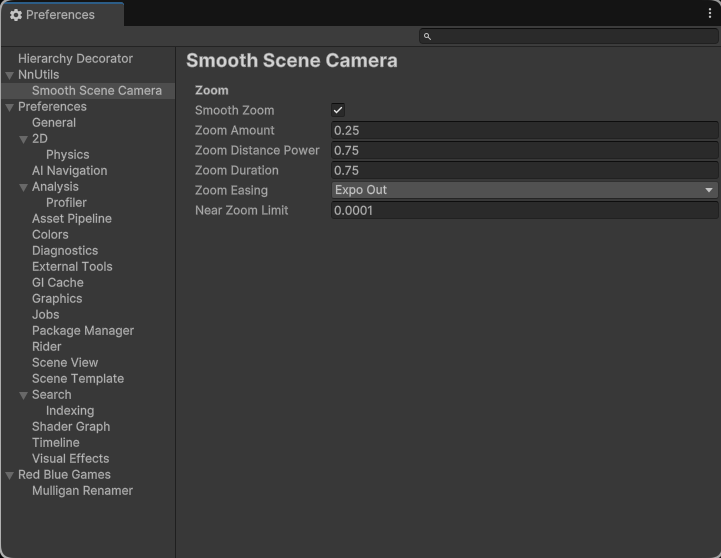

<h1 align="center">Smooth Scene Camera</h1>

This asset brings what every major engine has to Unity: 🧈 **smooth scene camera zoom**.

<p align="center">
  
</p>

# Usage

## Unity Version
This asset has been developed with Unity 6 but should be backwards compatible.

## Dependencies *(Skip if using the Package Manager)*
This asset depends on the [Editor Coroutines](https://docs.unity3d.com/Packages/com.unity.editorcoroutines@1.0/manual/index.html) package, make sure you have it installed.

## Installation

### Package Manager
Open the Package Manager and add a new **git** package:
```
https://github.com/nnra6864/SmoothSceneCamera.git
```

### Clone
You can simply clone this repository into your `Assets` directory:
```
git clone https://github.com/nnra6864/SmoothSceneCamera
```

### Asset Store
Coming Soon

## Customization
Every aspect of this asset is highly customizable.<br/>
Open the `Preferences` window and enjoy 😏



### Settings:
- **Smooth Zoom** - Toggles the smooth zoom option *(Default: true)*
- **Zoom Amount** - Amount of zoom per scroll step *(Default: 0.25)*
- **Zoom Distance Power** - Exponent that the distance multiplier is raised to *(Default: 0.75)*
- **Zoom Duration** - Duration of the zoom animation in seconds *(Default: 0.75)*
- **Zoom Easing** - Easing applied to the zoom motion *(Default: Expo Out)*
- **Near Zoom Limit** - Minimum distance to the zoom pivot *(Default: 0.0001)*

# Contributing
I would highly appreciate community contributions.<br/>
If you have a feature in mind that would fit this asset, simply fork this repository and make a pull request.

# Pwease Donate 🥺
If you are enjoying this asset, please consider donating something: [ko-fi](https://ko-fi.com/nnra6864)
